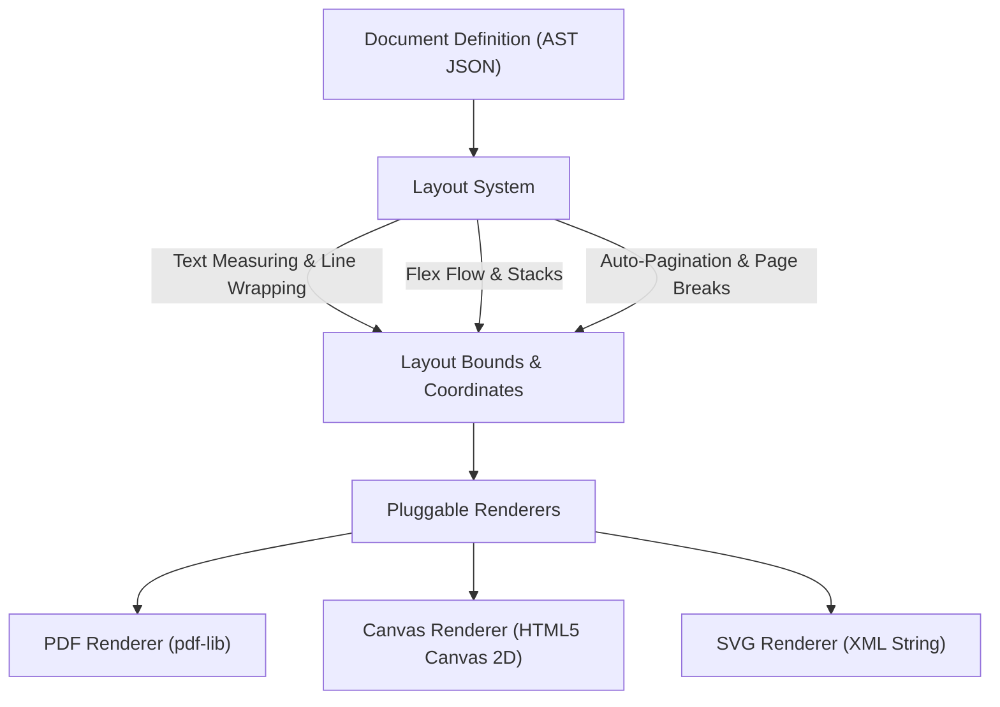

# Architecture & Design: doc-engine

## Executive Overview

`doc-engine` is a pure TypeScript document layout and vector rendering engine. It extracts the document representation, layout calculations, text measurement, font metrics, vector drawing, and PDF generation from Resumagic and reimagines them as a modular, standalone open-source library.

---

## The 9-Phase Architecture Implementation

### Phase 1: Separation from Resumagic
- **Purged**: Authentication (Firebase Auth), AI resume prompt orchestration (Gemini/OpenAI), job match scoring, ATS formatting hacks, billing/credits, user dashboards, and resume-specific edit wizards.
- **Retained & Generalized**:
  - Document & Page AST representation
  - Element primitives (Text, Shape, Image, View, Line, Path)
  - Coordinate system geometry
  - Text wrapping and measurement
  - Vector path drawing (SVG paths)
  - PDF rendering pipeline

### Phase 2: Total Elimination of Python
- Resumagic previously relied on a 450MB+ Python backend with ReportLab, PyMuPDF, Flask, and Pillow.
- `doc-engine` replaces the entire Python stack with 100% portable TypeScript.
- **Zero native binaries**: No `node-canvas`, no `cairo`, no `puppeteer`.
- **Runs anywhere**: Modern Browsers, Web Workers, Node.js (18+), Vercel Serverless/Edge, Cloudflare Workers, Deno, and Bun.

### Phase 3: Core Engine Architecture
The internal system is strictly decoupled into 4 layers:



1. **Document Representation System (`src/core/`)**:
   - `DocumentDefinition`: Serializable JSON AST holding pages, metadata, and elements.
   - `DocumentBuilder`: Fluent programmatic builder API.
   - `DocumentEngine`: Stateful document manager with atomic undo/redo history.
2. **Layout System (`src/layout/`)**:
   - `text-measure.ts`: Deterministic glyph metrics (AFM) for instantaneous character and string width calculations.
   - `text-wrap.ts`: Greedy line-packer with O(log N) binary search fit for breaking unbroken tokens (URLs/hashes).
   - `auto-layout.ts`: Container flex/flow positioning (row/column, gap, padding, cross-axis alignment).
   - `pagination.ts`: Splits overflowing elements across multiple pages with margins, headers, and footers.
3. **Font Management System (`src/fonts/`)**:
   - Standard 14 PDF core fonts (Helvetica, Times, Courier, Symbol, ZapfDingbats) mapped across weights and styles.
   - Custom TrueType / OpenType font buffer registration.
4. **Rendering System (`src/renderers/`)**:
   - `pdf-renderer.ts`: True vector PDF compilation via `pdf-lib`.
   - `canvas-renderer.ts`: Real-time 60fps canvas preview for interactive web UIs.
   - `svg-renderer.ts`: Clean vector SVG string generator.

---

### Phase 4: Document Format as the Product
The Document AST is independent of any rendering target. It can be saved to a database, sent over WebSockets, streamed from an LLM, or transformed into PDF, Canvas, or SVG:

```typescript
export interface DocumentDefinition {
  id?: string;
  metadata?: DocumentMetadata;
  coordinateOrigin?: 'top-left' | 'bottom-left';
  defaultPageSize?: PageSizeName | PageDimensions;
  orientation?: PageOrientation;
  pages: PageDefinition[];
}
```

---

### Phase 5: PDF Layer via `pdf-lib`
Rather than writing a raw binary PDF parser from scratch, `doc-engine` uses [`pdf-lib`](https://github.com/Hopding/pdf-lib) as the low-level PDF object assembler. `doc-engine` handles all layout, coordinate inversion, text chunking, and vector geometry, passing pure primitives to `pdf-lib`.

---

### Phase 6: React Layer on Top
React is an adapter layer (`doc-engine/react`), not the engine core.
- **Declarative JSX**: `<Document>`, `<Page>`, `<View>`, `<Text>`, `<Shape>`, `<Line>`, `<Image>`.
- **Hooks**: `usePDF(doc)` for compiling PDFs reactively, `useDocument()` for live editing.
- **Viewer**: `<DocumentViewer>` for zoomable, paginated canvas previews and instant PDF export.

---

### Phase 7: Real Vector Primitives vs Fake Image Screenshots
| Feature | `html2canvas` / Screenshots | `doc-engine` Vector Output |
| :--- | :--- | :--- |
| **Text Quality** | Pixelated when zoomed in | Infinite vector sharpness |
| **Searchability** | Non-searchable bitmap | 100% searchable text |
| **Copy / Paste** | Unselectable image | Native text selection |
| **File Size** | 2MB – 15MB per page | 20KB – 150KB per page |
| **Screen Readers** | Inaccessible | Accessible PDF text tree |

---

### Phase 8: Diverse Real-World Examples
Included in `src/examples/`:
1. **Invoice Generator** (`invoice.ts`): Itemized billing table, tax calculation, total due badge, branding.
2. **Award Certificate** (`certificate.ts`): Landscape A4 with ornate borders, gold dividers, seal badge, signature lines.
3. **Executive Business Report** (`business-report.ts`): Multi-page report with KPI cards, strategic highlights, and vector bar charts.
4. **Modern Tech Resume** (`resume.ts`): High-end two-column portfolio resume.

---

### Phase 9: Lean Open-Source Release
The package builds using `tsup` into dual ESM (`.mjs`) and CJS (`.js`) bundles with full TypeScript declaration maps (`.d.ts`), weighing under **50KB gzipped** (excluding `pdf-lib`).
